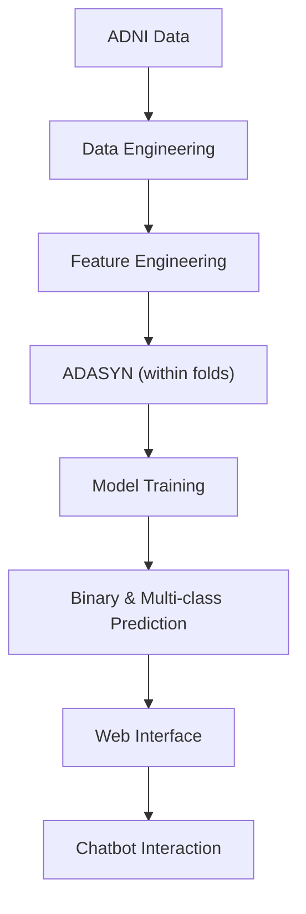

# 🧠 Alzheimer’s Disease Classification using Genome-Wide Biomarkers

A robust machine learning framework for **binary and multi-class Alzheimer’s Disease classification** using multimodal biomedical data from the ADNI dataset.  
The system integrates **genetic biomarkers, cognitive assessments, and demographic features**, along with a **chatbot interface** for user interaction and awareness.

---

## 📌 Problem Statement

Alzheimer’s Disease (AD) is a progressive neurodegenerative disorder that is difficult to detect in early stages. Traditional diagnosis often occurs late in the disease progression.

This project addresses the need for:

- Early-stage prediction  
- Reliable stage-wise classification  
- Multimodal biomarker integration  
- User-friendly interaction support  

---

## 🎯 Objectives

- Build a leakage-controlled ML pipeline for AD prediction  
- Perform **binary classification** (AD vs Non-AD)  
- Perform **multi-class staging** (CN, MCI, AD)  
- Reduce high-dimensional genomic features  
- Handle class imbalance effectively  
- Compare multiple machine learning models  
- Integrate a chatbot for informational interaction  

---

## 🧬 Dataset

**Source:** Alzheimer’s Disease Neuroimaging Initiative (ADNI)

### Modalities Used

- Genome-wide SNP data  
- APOE4 genotype  
- Cognitive assessments (MMSE, CDRSB, ADAS, FAQ)  
- Demographic features (Age)

---

## ⚙️ Data Engineering Pipeline

1. Data acquisition from ADNI  
2. Subject ID harmonization and merging  
3. Missing value handling  
4. Metadata filtering  
5. Feature engineering  
6. Feature reduction  
7. Dataset standardization  

**Final dataset:** `merged_with_targets.csv`

---

## 🧪 Feature Engineering

### Feature Streams Explored

- Cognitive / Clinical features  
- Genetic features (SNPs + APOE4 + Age)  
- Hybrid early fusion  

### Feature Reduction Strategy

- Strict feature filtering  
- Mutual Information (SelectKBest)  
- Correlation pruning  

**Final compact set:** 31 features (binary)  
**Expanded set:** 120 features (multiclass)

---

## 🤖 Models Evaluated

- Logistic Regression  
- SVM (RBF)  
- Random Forest  
- XGBoost  
- CatBoost  
- LightGBM (comparison)

---

## ⚖️ Class Imbalance Handling

Class imbalance was addressed using:

- **ADASYN oversampling**
- Applied strictly **within training folds**
- Prevented data leakage

---

## 🔁 Validation Strategy

- Stratified Cross-Validation  
- Fold-wise preprocessing  
- Leakage-controlled pipeline  
- Hyperparameter tuning  

---

## 📊 Results

### Binary Classification (AD vs Non-AD)

| Model | Feature Set | Accuracy |
|------|------------|----------|
| XGBoost (Final) | 31 features | **82–85%** |

✅ Stable  
✅ Generalizable  
✅ Biologically meaningful  

---

### Multi-Class Classification (CN / MCI / AD)

| Model | Feature Set | Accuracy |
|------|------------|----------|
| XGBoost | 31 features | 57% |
| LightGBM | 31 features | 61% |
| **CatBoost (Final)** | **120 features** | **89–90%** |

**Key observation:** Major improvement in MCI detection.

---

## 🧠 Chatbot Module

A lightweight chatbot interface was integrated to:

- Provide Alzheimer’s-related information  
- Assist users interactively  
- Demonstrate AI-assisted healthcare support  

⚠️ The chatbot is **informational only** and not for medical diagnosis.

---

## 🏗️ System Architecture

---

## 🚀 Key Contributions

- Multimodal AD prediction pipeline  
- Leakage-safe preprocessing  
- Compact yet stable feature selection  
- Strong ensemble performance  
- Improved MCI stage detection  
- Integrated user-facing chatbot  
- Reproducible experimental setup  

---

## 📈 Future Scope

- External clinical validation  
- Integration of MRI/PET imaging  
- Longitudinal progression modeling  
- Real-time clinical deployment  
- Explainable AI enhancements  
- Larger multi-omics integration  

---

## ⚠️ Disclaimer

This project is developed **for research and educational purposes only**.  
It is **not intended for clinical diagnosis or medical decision-making**.

---

## 👩‍💻 Authors

- V Sanjana Devi  
- Sneha M  
- Santhoshimaa M K  

Department of Information Science and Engineering  
CMR Institute of Technology, Bengaluru

---

## ⭐ Acknowledgment

Data used in this project were obtained from the  
**Alzheimer’s Disease Neuroimaging Initiative (ADNI)**.

For academic queries or collaboration, please contact the authors via institutional email.

---
